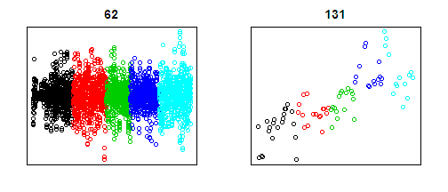

Predicting Activity Using Sensor Data
========================================================

This report analyzes a Human Activity Recognition study of 6 subjects who participated in an exercise lifting a dumbbell in five different ways - the correct way (A) and 4 incorrect ways (B, C, D, E). The purpose of the study is to use the data from various sensors (wrist, biceps, belt, and dumbbell) to predict which way the dumbbell was lifted in each case. The training data set consists of 19622 observations of 160 features.

## Preliminary Data Exploration

After loading the training data, I subsetted the data into 6 parts by "user_name" (for smaller expoloratory data sets). I made plots of each variable coloring the points by the activity "classe" to see if any of the variables seemed to distinguish among the 5 activities. Some of these plots are shown below.


```r
data <- read.csv("../pml-training.csv")
charles <- subset(data, user_name == "charles")
pedro <- subset(data, user_name == "pedro")
# set graphing parameters
par(mfrow = c(1, 2), xaxt = "n", yaxt = "n", mar = c(2, 2, 2, 2) + 0.1)
plot(charles[, 62], col = charles$classe, main = "62")
plot(charles[, 131], col = charles$classe, main = "131")
```

 

There were many plots like 62 where all 5 classes showed little differentiation. There also were many plots like 131 which show some differentiation but were very sparse.

```r
sum(is.na(data[, 131]))
```

```
## [1] 19216
```

```r
19216/19622
```

```
## [1] 0.9793
```

In fact, in the case of column 131, 98% of the data was missing. Not very helpful. However some columns showed more promise, as shown in the following plots.

```r
# set graphing parameters
par(mfrow = c(1, 2), xaxt = "n", yaxt = "n", mar = c(2, 2, 2, 2))
plot(charles[, 120], col = charles$classe, main = "120")
plot(charles[, 121], col = charles$classe, main = "121")
```

 


## Choosing the features

After viewing all the plots, I chose the following 7 variables as features (column number and name): 10 "yaw_belt", 86 "yaw_dumbbell" ,102 "total_accel_dumbbell", 118 "accel_dumbbell_z", 119 "magnet_dumbbell_x", 120"magnet_dumbbell_y", and 121 "magnet_dumbbell_z". These seemed to capture the most variation and none of them had missing values.

## Results

I used a vector of random binomials to extract 60% of the data for a training set and 40% for cross-validation and ran a Random Forest algorithm on the training set. I used the resulting model to predict the training set and validation set. After trying (the default) 500 trees in the Random Forest, I tried it with 100 and 200 trees and got slightly better results with 200.


```r
set.seed(123)
trainIndicator = rbinom(19622, size = 1, prob = 0.6)
training <- data[trainIndicator == 1, ]
validing <- data[trainIndicator == 0, ]

library(randomForest)
```

```
## randomForest 4.6-7
## Type rfNews() to see new features/changes/bug fixes.
```

```r
modelFit <- randomForest(classe ~ yaw_belt + yaw_dumbbell + total_accel_dumbbell + 
    accel_dumbbell_z + magnet_dumbbell_x + magnet_dumbbell_y + magnet_dumbbell_z, 
    data = training, importance = TRUE, ntree = 200)

predTrain <- predict(modelFit, training)
predValid <- predict(modelFit, validing)
resultsTrain <- predTrain == training$classe
resultsValid <- predValid == validing$classe
summary(resultsTrain)
```

```
##    Mode   FALSE    TRUE    NA's 
## logical      13   11859       0
```

```r
summary(resultsValid)
```

```
##    Mode   FALSE    TRUE    NA's 
## logical     549    7201       0
```

```r
11859/(11859 + 13)
```

```
## [1] 0.9989
```

```r
7201/(7201 + 549)
```

```
## [1] 0.9292
```


The results were 99.8% correct for the training set and 92.9% correct on the validation set. The expected out-of-sample error is about 7.1%.

Finally I ran the prediction model on the test set and submitted my answers to the course Web site. I got 17 out of 20 correct. This is 85% correct or a 15% error rate, twice what is expected, but I think this is due to the size of the test set being so small.


